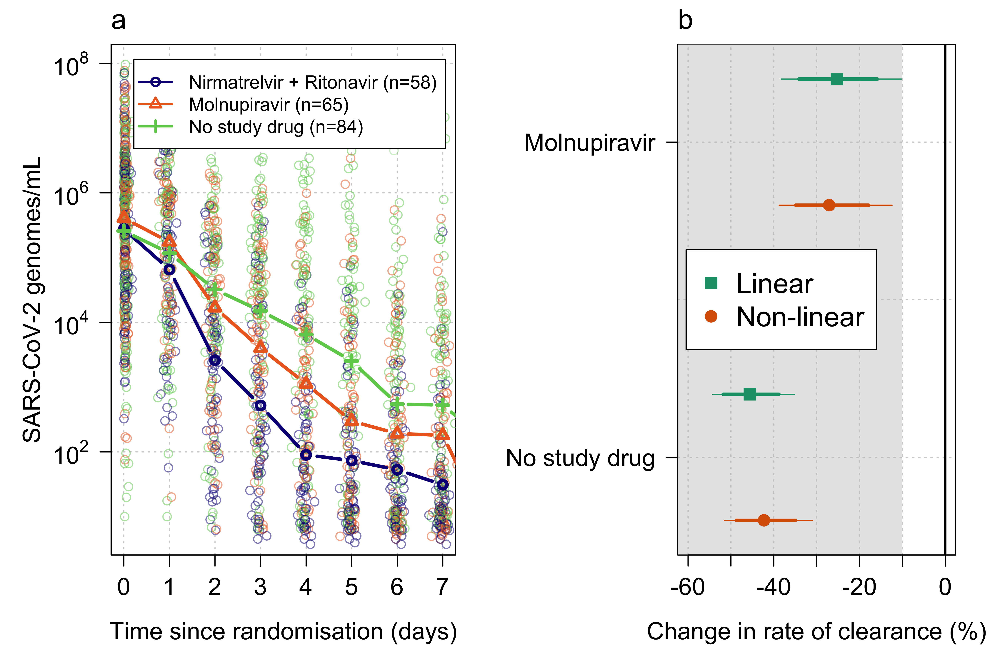
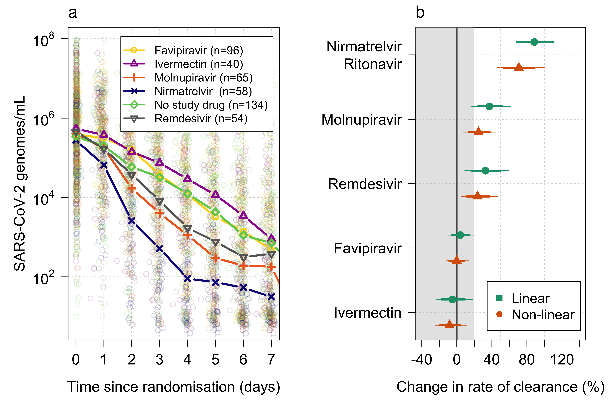

# Molnupiravir versus Paxlovid
 
 This repository provides the code and data underlying the molnupiravir versus ritonavir-boosted nirmatrelvir (paxlovid) versus no study drug comparison in the PLATCOV trial. 

This github repository accompanies our publication in Lancet Infectious Diseases: "Antiviral efficacy of molnupiravir versus ritonavir-boosted nirmatrelvir in patients with early symptomatic COVID-19 (PLATCOV): an open-label, phase 2, randomised, controlled, adaptive trial"
 
 
## Overview

The primary three-way analysis is given in the file *Molnupiravir_analysis.qmd*. This constructs the mITT population, makes a baseline characteristics table, sets up the data for the analysis, and then plots the outputs. It also looks at fever clearance and time to symptom resolution. All models are run in *stan* and the stan code is provided in the folder *Stan_models*. The data are provided in the folder *Analysis_Data*.

The main result is Figure 2 in the paper (I think my version is better than the published Lancet version as they have an ill-advised policy of removing grid lines and taking away the fading of the individual data points):

In addition, the file *Meta_analysis_IPD.qmd* runs a meta-analysis of all unblinded patients randomised to small molecule drugs in the PLATCOV trial since the start of platform (same site, but not all randomised concurrently). We add a slope/intercept covariate for trial epoch (defined as times when interventions entered or left the platform) to adjust for possible temporal confounding. The main result is Figure 5 in the paper showing the estimated ranking of the antiviral drugs (effects relative to no study drug arm):

## Data 

The raw data are given as csv files in the folder *Analysis_Data*. The version of the SAP used for this analysis is provided in the main folder (*PLATCOV_SAP_v3.1_11032023.pdf*)

Any questions or bugs spotted send me a msg at jwatowatson at gmail dot com
